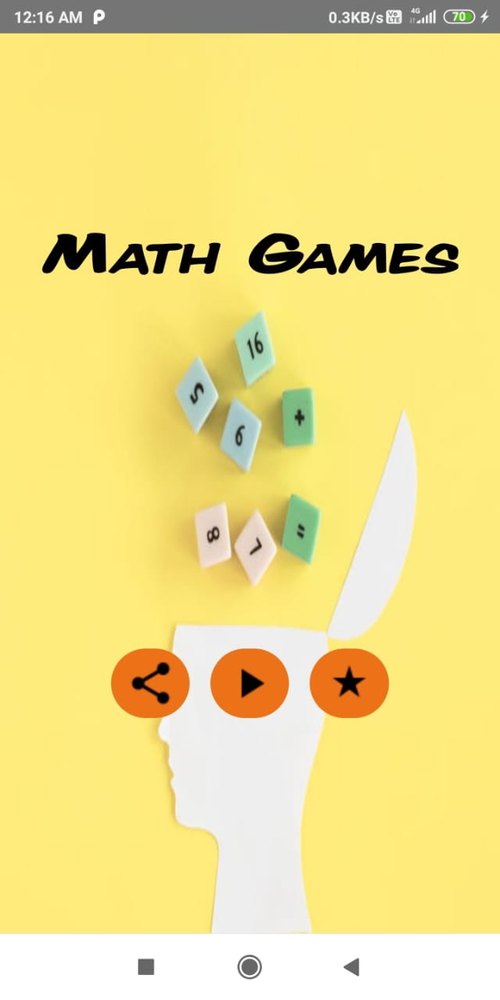
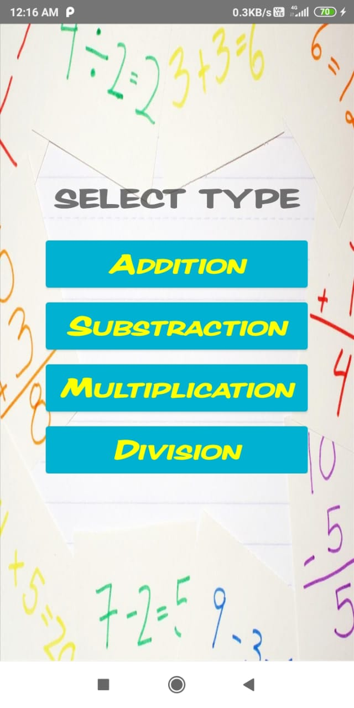
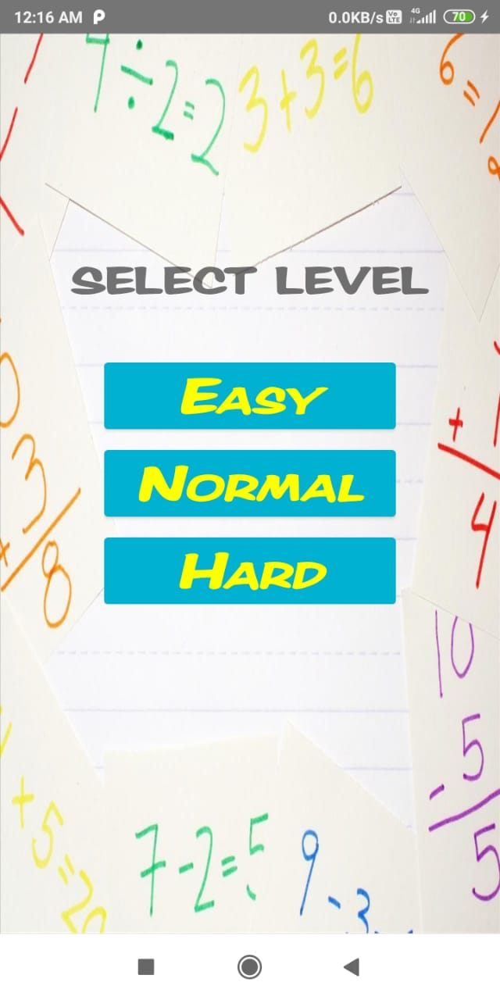

An App where a students of class 1 to 9 can play a game on basic mathmatics operations as per their choices and levels in limited time period
and get instant result.they can improve their basic math skills. 

# Tech Stack
Android SDK 
Java 
SQLite 

# Screenshots
 
<b>HomeActivity</b>

<b>Game Type</b>

<b>Level Type</b>

<b>GameActivities</b>

<b> Score Activity</b>

